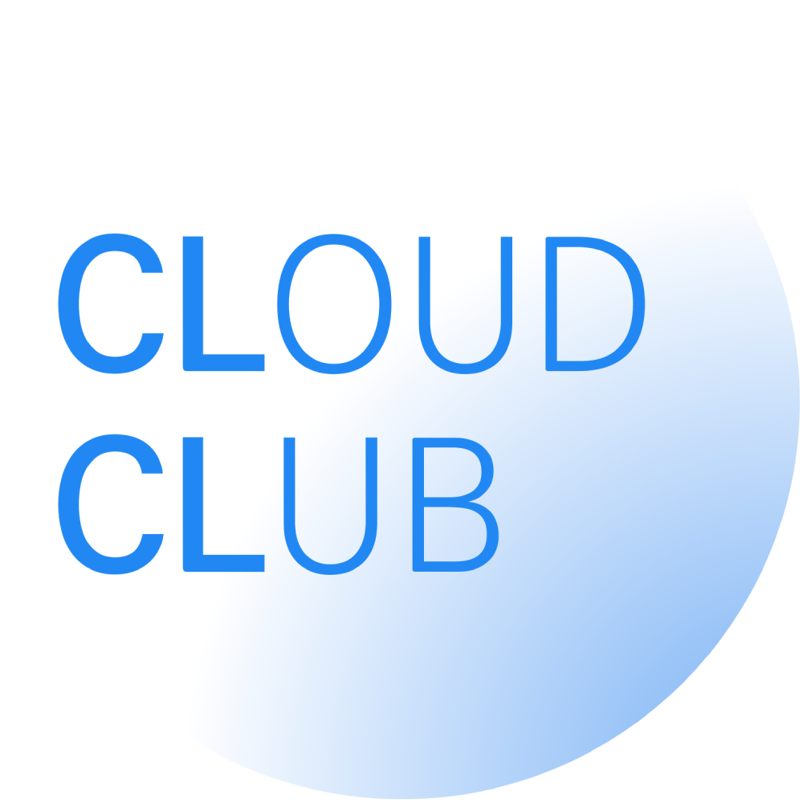

 

  
  <h1><a href="https://www.cloudclub.kr/">Cloud Club</a></h1>
  <h3>클라우드의, 클라우드에 의한, 클라우드를 위한 ☁️</h3>
  
Cloud-native 기술과 vendor-neutral 인프라를 함께 배우고, 경험하고, 성장하는 IT 연합 동아리

  <!-- 깃허브 팔로워 -->
  
  <!-- 깃허브 views -->
  

 

## 🚀 Cloud Club이란?

**Cloud Club**은 클라우드 네이티브(**cloud-native**) 기술을 사랑하는 사람들이 모여, 벤더에 종속되지 않고(**vendor-neutral**) 다양한 인프라를 경험할 수 있는 **IT 연합 동아리**이자 **IT 커뮤니티**에요.

**🌐 CNCF Landscape**: Kubernetes, Prometheus 등 클라우드 네이티브 기술을 포함한 다양한 오픈소스 기술들을 탐험해요.  
**☁️ Cloud**: AWS, GCP, NCP 등 여러 클라우드 인프라 기술들을 경험해요.  
**⚙️ DevOps**: 개발과 배포를 자동화하고 효율적으로 운영하는 기술들을 공부해요.  
**🤖 MLOps**: 머신러닝 모델의 배포부터 관리까지 자동화하는 기술들을 배우고 적용해요.  
**🔭 Monitoring**: 시스템 상태와 성능을 모니터링하고 장애를 빠르게 감지하는 기술들을 공부해요.  

## 🌎 Cloud Club은 왜 vendor-neutral을 지향할까요?

CNCF에 대해 알고 계신가요?
CNCF는 클라우드 네이티브 생태계를 이끌어가는 조직으로, 다음과 같은 슬로건을 내걸고 있어요.

> "CNCF is the open source, vendor-neutral hub of cloud native computing, hosting projects like Kubernetes and Prometheus to make cloud native universal and sustainable."

Cloud Club은 위 슬로건에서 **vendor-neutral**이라는 토픽에 초점을 맞추었어요. AWS만, Docker만, 특정 벤더에 대해서만 공부하는 것이 아닌 폭 넓은 클라우드 인프라 경험을 추구해요.

## 📢 Cloud Club에서 하는 활동

**👨‍💻 시즌1, 2 스터디**: 클라우드, DevOps, 모니터링, 개발, 데이터 엔지니어링, MLOps 등 클라우드와 관련된 다양한 주제로 스터디나 프로젝트를 진행해요.  
**💼 알.클.신.Job**: 현업에 종사하는 클둥이들이 취업 및 직무 관련 꿀팁을 취준 클둥이들에게 공유해요.  
**🎤 클클콘**: 클라우드 관련 지식과 경험을 클둥이들 및 외부 사람들에게 발표해요.  
**🙌 클클 버디**: 다양한 테마의 네트워킹 그룹에 참여해요.  
**😎 TF:** OB 클둥이와 YB 클둥이가 함께 공부하거나 취미 활동을 해요.

## 💡 Cloud Club을 만나려면?

**⛅ HomePage**: Cloud Club의 활동 내역, 운영 계획, 리크루팅 정보 등을 확인할 수 있어요.  
**👔 LinkedIn**: Cloud Club만의 네트워킹과 인사이트를 공유받을 수 있어요.  
**📺 YouTube**: 클클콘과 스터디 발표 등 다양한 콘텐츠를 영상으로 볼 수 있어요.  
**📸 Instagram**: Cloud Club의 최신 소식을 사진으로 만나볼 수 있어요.  
**✒️ Medium**: 기술 블로그를 통해 Cloud Club의 다양한 글을 확인할 수 있어요.

   
  
☁️ <strong>다양한 온라인 채널을 통해, 지금 바로 Cloud Club을 만나보세요!</strong> 🚀

  <!-- 홈페이지 -->
  
  <!-- 링크드인 -->
  
  <!-- 유튜브 -->
  
  <!-- 인스타그램 -->
  
  <!-- 미디움 -->
  
  

